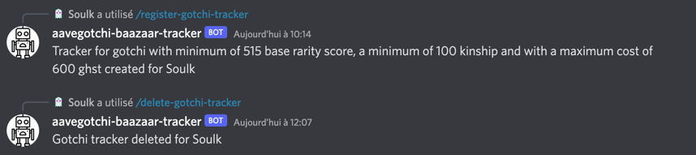
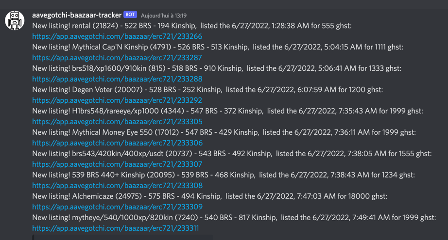

## Aavegotchi market tracker

It is for me a good exercise to get more familiar with web3 dev environment and mechanics.

Any comment, remark or suggestions would be highly appreciated.

## Main actions

The purpose of the app is to notify a channel the listings of gotchis as a passive thing.

You can also set a tracker with parameters for yourself. This tracker will take some parameters (ghst cost, brs minimum, kinship minimum) and each time a listing posted match your requirement you'll get DM from the discord bot.

For now here the commands listed commands :
* ```/register-gotchi-tracker``` : Set a gotchi tracker for yourself
* ```/delete-gotchi-tracker``` : Delete gotchi tracker set for yourself
* ```/help``` : Get all available commands


## How it works ##


An user can use the command ```/register-gotchi-tracker``` to create a tracker based on his choice, the tracker will be registered on the db.
All gotchis listed to the baazaar are pulled each 5 minutes and set locally on a json database.
During this routine the bot will try to match the new listed gotchis with users that register a tracker. On match, a DM with all matched gotchis will be send to the users.
## Prerequisites

* node
* [Discord bot](https://discordjs.guide/preparations/setting-up-a-bot-application.html#creating-your-bot) set
* (pm2 if wanted)


## IMPORTANT ##
Please don't hesitate to ask if you're not sure about a specific part of the code before starting it.

## Steps to install

### 1. Clone the repo

```bash 
https://github.com/dfit/aavegotchi-market-tracker.git
```

### 2. Install npm package

```bash 
npm install
```

### 3. Env vars

Every needed information (token/id/...) and the way to obtain them is describe in the [discordjs](https://discordjs.guide/#before-you-begin) guide.
```bash 
export DISCORD_TOKEN=<enter-your-discord-token>
export ID_BAAZAAR=<enter-your-baazaar-channel-id>
export ID_CLIENT=<enter-your-application-id> //go to https://discord.com/developers/applications/me and find "application id" and copy it
export ID_GUILD=<enter-your-discord-server-id> //right click on channel and select "copy id"
```

### 4. How to run the bot
```bash
node main
```

### 5. How to run the bot (alternative)

Alternatively you can use the [pm2](https://pm2.keymetrics.io/docs/usage/quick-start/) command to run your bot on background and managing it a little bit better.

You can add the `--no-autorestart` to `pm2` command in order to only execute the bot once.

```bash
pm2 start main.js --no-autorestart
```

### 6. Example

`node main`
```bash
[2022-06-27 13:23:20.833] [LOG]   Successfully registered application commands.
[2022-06-27 13:23:21.238] [LOG]   Ready!
[2022-06-27 13:23:23.414] [LOG]   No new listed gotchi found
```
Create and delete tracker for users :

DM when ghst/kinship/brs matched :

